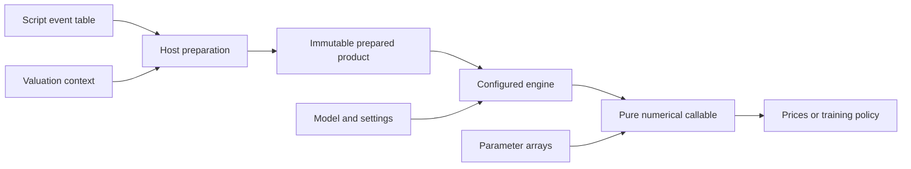

# Functional core and numerical contracts

## Preparation and execution boundaries

An immutable event table enters a host preparation pipeline. A complete valuation context is captured before partitioning dates or resolving observations. Parsing, schedule expansion, domain analysis and historical replay construct an immutable `PreparedProduct`. Mutable builders remain local to this construction; their contents do not become shared business state.

Exact future events apply domain and condition folding. Fuzzy future events retain continuous comparisons and blend states with the selected smoothing kernels. Historical events use hard decisions. Named historical script parameters can be replayed in JAX so their sensitivities propagate into future prices.

Inactive branches receive safe operands before division, logarithms, powers and other unsafe arithmetic, preventing NaNs from entering reverse-mode derivatives. Fuzzy endpoint selection also removes unused branch and condition adjoints. Constant analysis annotates immutable nodes; named script parameters stay live. Literal `MAX`/`MIN` folding uses all arguments, matching DAL's tree evaluator rather than the two-argument shortcut of its older compiled evaluator.

`prepared.engine(model, settings)` chooses ordinary Monte Carlo or LSMC based on exercise statements. Factories own host planning and caches. Their returned numerical callables consume parameter trees and return values or new state without updating host diagnostics.

## Ownership and remaining shared state

| Resource | Owner and lifetime |
| --- | --- |
| Dates, fixing history, valuation policy | Immutable captured context; optional explicitly owned session publishes replacements |
| Static dispatch/calendar tables | Read-only mappings with private backing dictionaries and immutable contents |
| Sobol directions and digital shifts | Each generator owns read-only NumPy tables; no module memoization |
| Bridge plans and PRNG key planning | Constructed by the requesting engine; no library global memoization |
| Pricing/collection factories | Private engine caches, released with `clear_cache()` or engine disposal |
| LSMC policy and diagnostics | Immutable training/valuation result, independent of subsequent engine calls |
| Legacy setters | One deprecated process-wide compatibility session |
| x64, device topology, JIT/persistent caches | JAX process runtime; configured at application startup |

The legacy compatibility session and JAX runtime are explicit exceptions to the no-global-mutable-state rule. A complete context never falls back to the legacy session. Locks make session snapshots atomic; they do not make a sequence of legacy setters request-isolated. There is no claim that JAX or the legacy DAL API is globally pure.

Native model records and plans are frozen. Model parameters remain dynamic JAX arrays, including GSR curve, `g`, `H`, leverage and variance-process inputs. Factor correlations remain configured model data. Static planning records indices, interpolation weights and segment widths without freezing the differentiable values. Array-valued state records use `jax.Array` types; GSRSLV step fields are named rather than sliced by tuple position.

The model protocol separates `allocate(timeline, sample_defs)` host planning, parameter-dependent `init(params, plan)` and single-path `generate(state, plan, normals)`. A `Scenario` stores a spot and numeraire per date plus padded observation and discount slots; `SampleDef` records which slots each date needs. Initial coefficients are shared across paths, and gradients flow through initialization. `Scenario.samples()` unstacks each field once to avoid repeated reverse-mode padding.

The low-level `PathProduct` contract accepts a single-path payoff returning numeraire-deflated values in `payoff_names` order. An optional `initial_state(params)` supplies shared state as its fourth argument. Script preparation generates that callback internally; user examples express their payoffs as event tables.

## Batching and dependent loops

Each ordinary Monte Carlo block batches independent paths with `vmap`. Devices own contiguous block ranges, and each device scans its blocks. Model generation and event execution preserve the time recurrence. Adjacent equivalent script events can share one scan body, with date-specific constants and observations supplied as slots.

GSR planning resolves calendar dates, knot intervals and curve interpolation slots on the host. Initialization batches interval coefficients, curve samples and covariance factors across the event/maturity axes. Ordered scans integrate the segments within each interval. GSRSLV and Gaussian hybrids reuse these batched coefficients and prefix integrals instead of tracing a separate numerical expression for every date.

LSMC host fitting walks exercise dates backwards because each holding value depends on the next event's target. Fixed-shape device fitting expresses that same recurrence as a reverse scan. Independent degree candidates and parameter bumps are batched. Multivariate normalization uses a masked ordered Welford scan on CPU; GPU host QR retains host Welford because the measured device scan was slower. Small heterogeneous host loops, triangular factor solves and the Sobol bit loop remain where their dependency or measured backend behavior favors them.

Replicated parameters entering a manual device mesh are cast to device-varying values once. Scan initial carries must have matching manual-axis variation. This avoids repeated reverse-mode cross-device reductions and inconsistent carry types. Distributed and singular-covariance tests cover that contract.

## Random streams, precision and reductions

Sobol global path `id` corresponds to point `id + 1`. Gray-code XOR uses the exported DAL direction table. Device assignment and ordinary block size do not change that point. Digital shifts use the high 32 bits of successive SplitMix64 outputs, with unsigned 64-bit wraparound. Vectorizing shift coordinates preserves exact integer streams.

Pseudo-random draws fold the block id into a key. Their stream is stable across device layouts at fixed block size; changing the block size changes paths. RBG key batches are mapped sequentially because its native batching semantics can otherwise replace per-key streams. Pseudo-random streams are not pointwise DAL-compatible.

Default path precision and inverse-normal generation are float64. Float32 casts path arrays after normal generation; within-block reductions use path precision, while block accumulation is float64. Narrow fuzzy transitions can produce inaccurate float32 risks even when prices agree.

Standard reduction uses efficient block/device accumulation. Deterministic reduction sums block prices and Jacobians in global block order for device-count reproducibility; its custom differentiation supports reverse mode. Shared historical replay happens once per device in standard reduction and once per block in deterministic reduction to preserve independent block Jacobians. Floating-point reassociation is therefore a numerical decision, not a formatting change.

## LSMC records and memory

Phase A uses `path_collector()` to gather exact payments, features, conditions, numeraires and error flags in global path order. Phase B returns a policy and regression diagnostics. Phase C prices fresh paths with passive policy arrays. `evaluate()` returns a new immutable result containing values, replica prices and the training result.

Ordinary pricing keeps simulation bounded by the block size. LSMC training materializes all records and therefore grows with paths, events and feature count. Vectorizing an independent axis does not remove that storage cost. Compiler temporary-buffer estimates, allocator reservations and actual peak memory are distinct measurements; the refactoring benchmark reports only compiled temporary buffers.

Use [the user guide](user-guide.md) for workflows, [the LSMC guide](p6-p7.md) for regression/risk definitions, and [the refactoring report](refactoring.md) for accepted and rejected performance changes.
